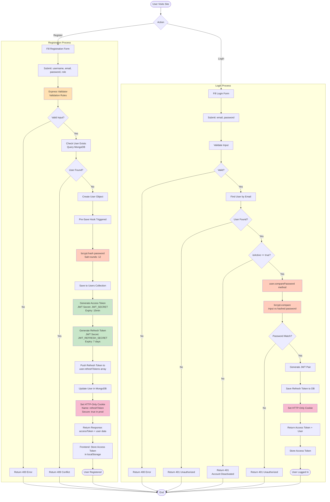
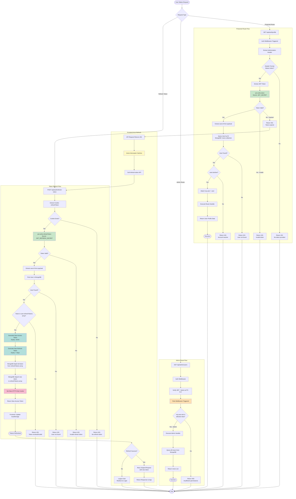
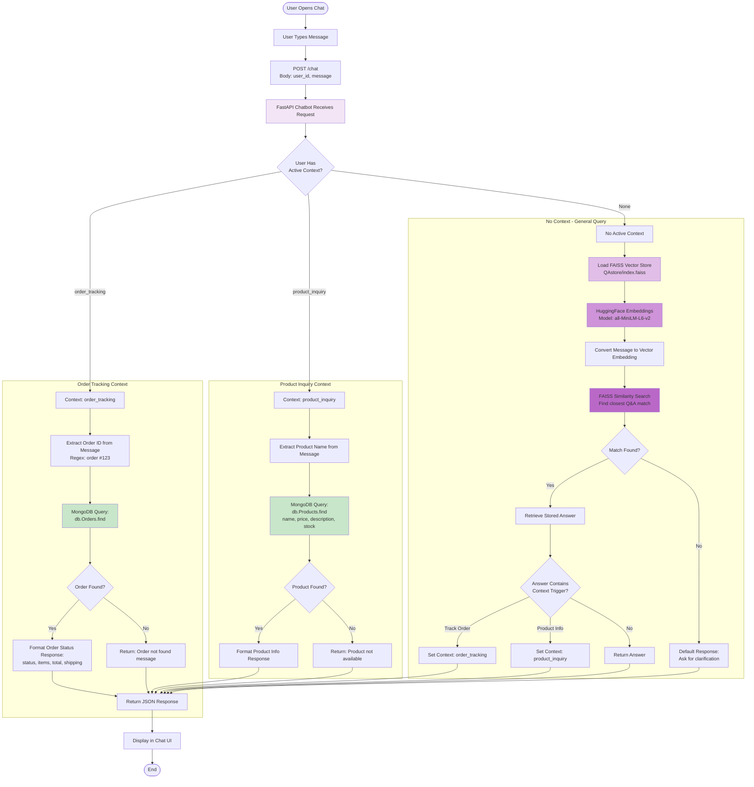
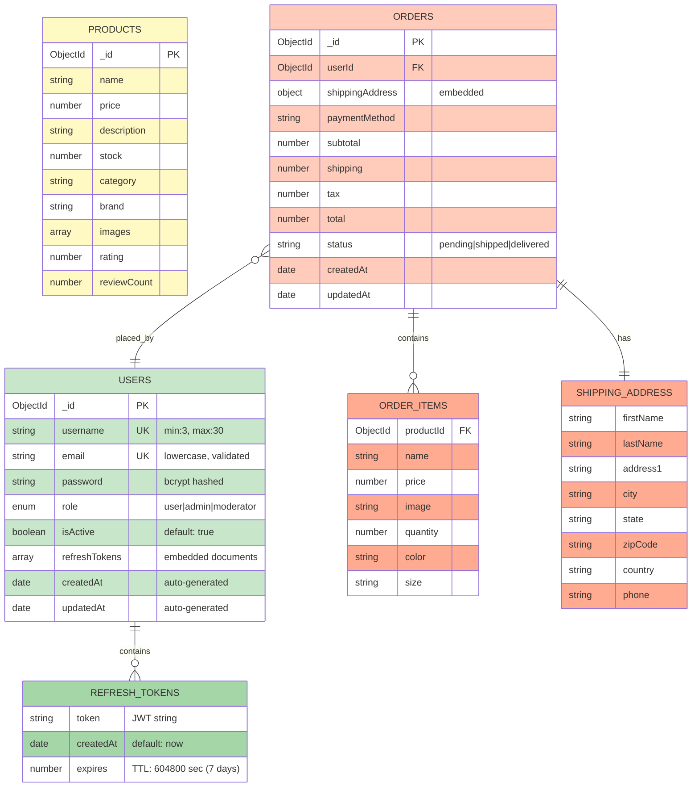
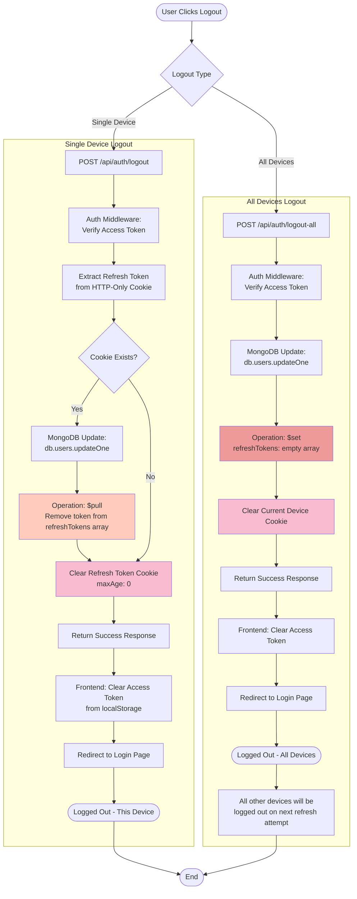
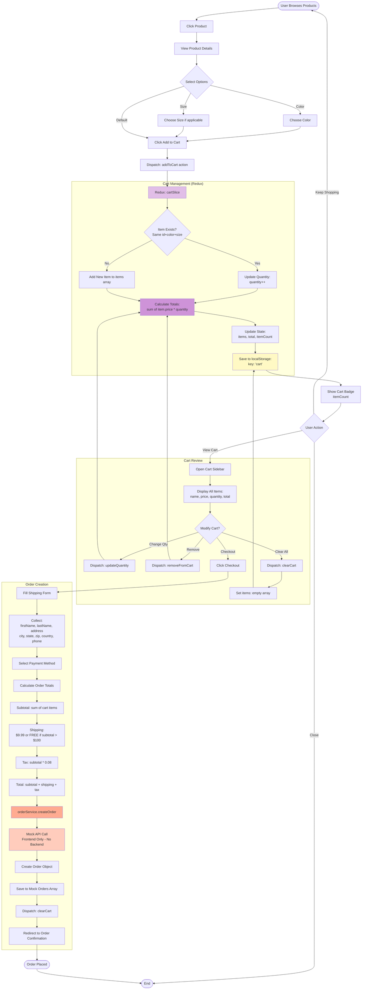
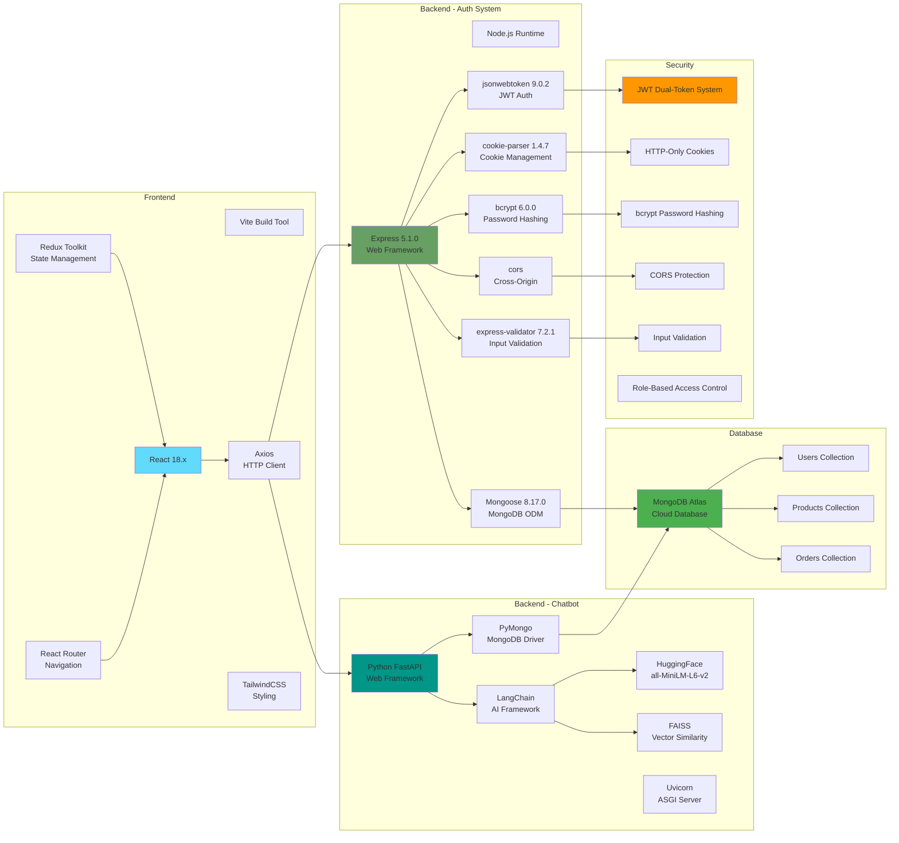

# E-Commerce Backend & Database Flowchart

## Complete System Architecture Diagram (Mermaid)

```mermaid
graph TD
    subgraph "Client Layer"
        A[React Frontend<br/>Port: 5173]
        A1[Redux Store<br/>Cart State]
        A2[LocalStorage<br/>Access Token]
    end

    subgraph "Backend Services"
        B[Express Auth Server<br/>Port: 5000]
        C[FastAPI Chatbot<br/>Port: 8000]
    end

    subgraph "Database Layer"
        D[(MongoDB Atlas<br/>Cloud Database)]
        D1[Users Collection]
        D2[Products Collection]
        D3[Orders Collection]
        D4[FAISS Vector Store<br/>QA Knowledge Base]
    end

    subgraph "Auth System Flow"
        E[POST /api/auth/register]
        F[POST /api/auth/login]
        G[POST /api/auth/refresh-token]
        H[GET /api/auth/profile]
        I[POST /api/auth/logout]
        J[POST /api/auth/logout-all]
        K[GET /api/admin/users]
    end

    subgraph "Authentication Processing"
        L{Validate Input}
        M{User Exists?}
        N[Hash Password<br/>bcrypt - 12 rounds]
        O[Create User Document]
        P[Generate JWT Pair]
        Q[Save Refresh Token<br/>to DB]
        R[Set HTTP-Only Cookie]
        S[Return Access Token]
    end

    subgraph "Middleware Layer"
        T[Auth Middleware<br/>JWT Verification]
        U[Role Middleware<br/>Admin/User/Moderator]
        V[Auto-Refresh Middleware<br/>Token Rotation]
        W[Validation Middleware<br/>express-validator]
    end

    subgraph "Token Management"
        X[Access Token<br/>Expiry: 15 min<br/>Header: Bearer]
        Y[Refresh Token<br/>Expiry: 7 days<br/>Cookie: HTTP-Only]
        Z{Token Valid?}
    end

    subgraph "Chatbot Flow"
        CB1[POST /chat]
        CB2{Has Context?}
        CB3[Order Tracking]
        CB4[Product Inquiry]
        CB5[FAISS Similarity Search]
        CB6[MongoDB Query]
        CB7[Return AI Response]
    end

    subgraph "E-commerce Flow (Mock)"
        EC1[Product Catalog<br/>Frontend Mock]
        EC2[Shopping Cart<br/>Redux State]
        EC3[Order Creation<br/>Frontend Mock]
        EC4[Order Management<br/>Frontend Mock]
    end

    %% Frontend to Backend Connections
    A -->|HTTP Requests| B
    A -->|Chat Messages| C
    A1 --> A
    A2 --> A

    %% Auth Endpoints
    A -->|Register Request| E
    A -->|Login Request| F
    A -->|Auto Refresh| G
    A -->|Protected Route| H
    A -->|Logout Single| I
    A -->|Logout All| J
    A -->|Admin Request| K

    %% Registration Flow
    E --> L
    L -->|Valid| M
    M -->|No| N
    N --> O
    O --> P
    P --> Q
    Q --> R
    R --> S
    S --> A2
    M -->|Yes| A

    %% Login Flow
    F --> L
    L -->|Valid| M
    M -->|Yes| P
    P --> Q
    Q --> R
    R --> S

    %% Middleware Protection
    H --> T
    K --> T
    I --> T
    J --> T
    T --> Z
    Z -->|Valid| H
    Z -->|Invalid| A
    K --> U
    U -->|Authorized| D1

    %% Token Refresh Flow
    G --> V
    V --> Y
    Y --> Z
    Z -->|Valid Refresh| P

    %% Database Connections
    B -->|Mongoose ORM| D
    O --> D1
    Q --> D1
    P --> D1
    C -->|PyMongo| D

    %% Chatbot Processing
    C --> CB1
    CB1 --> CB2
    CB2 -->|Yes - Order| CB3
    CB2 -->|Yes - Product| CB4
    CB2 -->|No Context| CB5
    CB3 --> CB6
    CB4 --> CB6
    CB5 --> D4
    CB6 --> D2
    CB3 --> D3
    CB5 --> CB7
    CB6 --> CB7
    CB7 --> A

    %% E-commerce Mock Flows
    A --> EC1
    EC1 --> EC2
    EC2 --> EC3
    EC3 --> EC4
    EC4 --> A1

    %% Database Collections
    D --> D1
    D --> D2
    D --> D3

    style A fill:#e1f5ff
    style B fill:#fff3e0
    style C fill:#f3e5f5
    style D fill:#e8f5e9
    style D1 fill:#c8e6c9
    style D2 fill:#c8e6c9
    style D3 fill:#c8e6c9
    style X fill:#ffccbc
    style Y fill:#ffccbc
    style T fill:#ffe0b2
    style U fill:#ffe0b2
    style V fill:#ffe0b2
```

## User Registration & Login Flow (Detailed)

## Protected Route Access & Token Refresh Flow

## Chatbot Integration Flow

## Database Schema & Collections

## Logout Flow (Single & All Devices)

## Shopping Cart & Order Creation Flow (Frontend Mock)

## Technology Stack Summary

---

## How to View This Flowchart

1. **Copy the Mermaid code** from any diagram above
2. **Paste into Mermaid Live Editor**: https://mermaid.live
3. **Or use in Markdown viewers** that support Mermaid (GitHub, GitLab, VS Code with Mermaid extension)
4. **Or integrate into documentation** tools like Docusaurus, MkDocs, Notion

## Notes

- **Implemented Features**: Authentication system is fully functional with JWT, MongoDB, and secure cookie management
- **Mock Features**: Products, Orders, and Shopping Cart are frontend-only (no backend API)
- **Database**: MongoDB Atlas cloud database with Mongoose ORM
- **Security**: Production-ready auth with bcrypt, JWT dual-token, HTTP-only cookies, and role-based access
- **Missing**: Payment integration, product/order APIs, email verification, password reset
